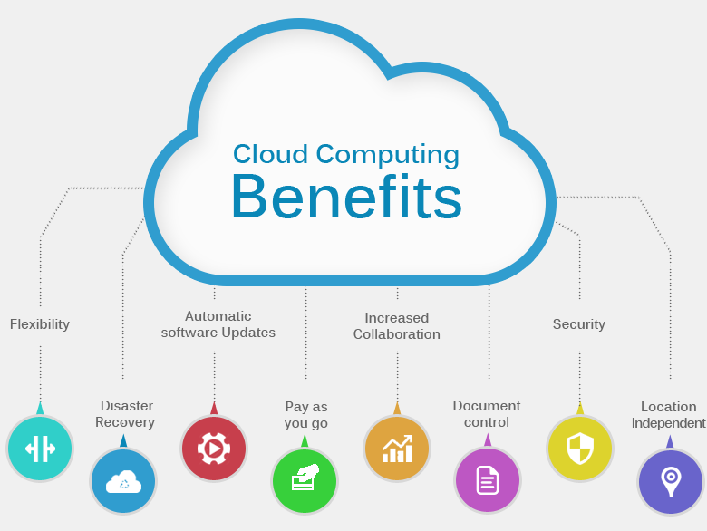
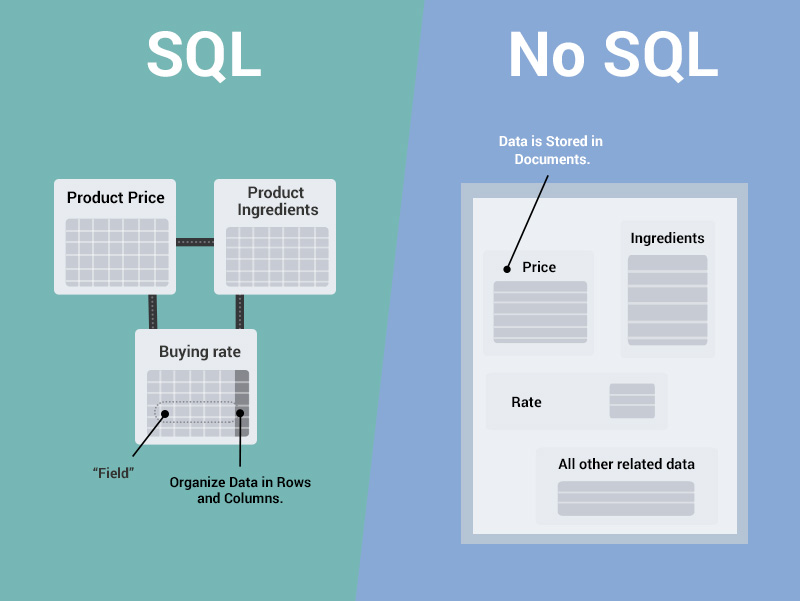

## Lecture 1: Cloud Databases

> ### Warm up 
>  - Read the following story: [Interxion Data Center in Bunker](https://arstechnica.com/information-technology/2019/06/why-a-former-nazi-sub-base-in-marseille-is-becoming-a-data-center/)
>
>    1. What is a data center? 
>    2. Why would companies use one?
>    3. What infrastructure would you expect a data center to provide?
>    4. What makes an old submarine bunker in Marseille a good place for a data center?
>
>    [What is a Data Center](https://www.youtube.com/watch?v=Amow8BJm5Go)
> 
>### Answers:
>

click to reveal

<ol>
	<li> A <b>Data Center</b> is a physical building that houses powerful computers that run companies' services (e.g. store clients' data, store company data, hosts websites, ... etc.)</li> 
	<ul>
		<li> A list of the <a href="https://www.rankred.com/largest-data-centers-in-the-world/#:~:text=China%20Telecom%20has%20the%20largest,Mainland%20China%20and%20overseas%20markets">12 largest Data Centers in the world</a></li> 
		<li> <a href="https://map.datacente.rs">datacenters on a map</a></li> 
	</ul>
    <li><b>The WHY:</b> companies use <b>rent out</b> data center services from big providers such as Google Cloud Services and Amazon Web Services `to avoid the huge costs` of buying, maintaining and paying the running costs of their own data centers</li> 
	<li><b>INFRASTRUCTURE:</b> Huge space (up to hundreds of thousands of square meters!!), thousands of racks of power computers, access to tens of MW of power, ability to cool the racks of computers continuously, very high bandwidth connectivity to the internet (usually with fiber links), high reliability (i.e. robustness against failure), physical security (against physical attacks and hacking)</li> 
	<li><b>BUNKER:</b> Very good networking infrastructure, physical security, safe legal and financial environment, access to adequate power</li>
</ol>

> ####  What is the advantage of having a database in the cloud?
> - Easy Administration. Improved agility and innovation. (set up and decommissioned very quickly)
> - Faster time to market. (saving time for finding, ordering, shipping installation of hardware and for network setup)
> - Reduced risks (Security, Recovery Backups = Loss Prevention)
> - Scalability
> - Accessibility
> - Lower costs

## Objectives

- What is a Cloud Service Provider ? 

- What are Cloud Databases ?

- Types of Databases

- Managing and Accessing Relational Databases 

- Database vs Data Warehouse vs Data Lake

  

## 1. What is a Cloud and a Cloud Service Provider ?

- In it’s most basic sense **a Cloud** is a computer running 24 hours a day 365 days a year that users can access whenever needed for various tasks

- A **Cloud Service Provider** is a company that has the resources (data centers, wide area network, ...etc.) to offer other companies and clients **IT infrastructure on demand**. Companies and clients can then scale up or down their different services and only pay the cloud service provider for what they actually use 

- Cloud Service Providers such as **Amazon** (Amazon Web Services), **Google** (Google Cloud Platform), **Microsoft** (MS Azure) and many others `offer hundreds of different cloud services` for the smallest to the largest of companies and individual customers/users

## 2. What is a Cloud Database ?

- A Cloud Database is one of the many cloud services that Cloud Service Providers offer

- A cloud database runs on a **cloud computing platform** (i.e. Google Cloud) and access to the database is provided as-a-service
	([more on SaaS vs PaaS vs IaaS](https://www.bmc.com/blogs/saas-vs-paas-vs-iaas-whats-the-difference-and-how-to-choose/), 
	[also here](https://www.ibm.com/topics/iaas-paas-saas))

- Storing data in a cloud database enables authenticated users to access data remotely, from anywhere in the world, via a working internet connection

- A much cheaper and faster option than managing a database on own server

## 3. Types of Databases

There are different Types of Database structures. We will be focusing on the ***relational databases***. But it is good to know the other database types.

**SQL database (relational databases) features:**

> A relational database is **table-oriented** where **every bit of data has a link with every other bit of data**. It has a row-based table structure which connects related data elements. **predefined relationships**

- use `flexible queries` to access data
- use queries that span `mutliple tables`
- enforce certain `constraints on your data`
- `well documented` access language (SQL is ISO standardized)
- **examples:** PostgreSQL, Mysql, Microsoft SQL Server, Oracle...

**NoSQL database features:**

> *A NoSQL database uses a variety of formats, such as documents, graphs, wide columns, etc, which offers great flexibility and scalability to a database design. (NoSQL stands for Not Only SQL)*

- when your access patterns are known beforehand and simple
- when data model fits (facebook connections graph)
- when you need flexible data storage/need to avoid constraints (NoSQL databases are schemaless)
- when you need low latency and easy horizontal scaling (ex: Apple has a 75,000-server NOSQL database!)
- **examples:** Cassandra, MongoDB, HBase, DynamoDB

**Other types of databases:** 

1. **Hierarchical database**: Hierarchical database follows a ranking order or a parent-child relationship to structure data.
2. **Network database**: Network database is similar to the hierarchical database but with some changes. The network database allows the child record to connect with various parent records, therefore, allowing two-directional relationships.
3. **Object-Oriented database**: In an object-oriented database, information is stored in an object-like manner.

> SIDEBAR: **SEQUEL or SQL?** https://www.codeconquest.com/blog/what-is-sql-or-sequel-whats-the-origin/

## 4. Managing and Accessing Relational Databases 

> explain the elements visually with a Chart like [HERE](https://docs.google.com/presentation/d/13V-gXIXltuM4sI6ERk8OlHWKO0SHTGBUFGROOsUWUMM/edit#slide=id.g14fe6e8ba1a_0_250) first (can be optimized!) then go over each of the following 

####  Relational Database Management System (RDBMS)

- A relational database management system (RDBMS) is a program that allows you to **create, update, and administer a relational database**

- Most relational database management systems **use the SQL language** to access the database and run queries

- Examples of famous RDBMS are **PostgreSQL, MySQL, Oracle, SQLite** and **Microsoft SQL Server**

- We will use PostgreSQL since it is very powerful but open-source, i.e. free to use without a license

#### Database Server

- **A database server is a computer which uses a DBMS** that provides database services to other computers, as defined by the **client–server model**

- Users access a database server through a **client** program running on the user's computer

- To access the database server, you need the following:

>1. the database server's host **IP address** (a.k.a DB end-point, this can be the **local host** if the DB is local on our machine)
>2. **User name** 
>3. **Password**
>4. **Port number** (depends on the DBMS)
>5. **Database name** (because there can be multiple databases on the same server)

#### Computer/Server Port

- A port number is a way to identify a specific **application** to which an internet or other network message is to be forwarded when it arrives at a computer/server

- All network-connected devices come equipped with standardized ports that have an assigned number

- These numbers are reserved for certain protocols and their associated function

- For example some of the most commonly used ports: 
  - Hypertext Transfer Protocol (HTTP) messages, for example, always go to port 80
  - Hypertext Transfer Protocol Secure (HTTPS) messages go to port 443

- For PostgreSQL, port 5432 is the default

#### Database Client

- the database **client** is any software that can be used to **connect** to the database server and **perform operations** on the data stored there (e.g. retrieve a table or parts of a table)

- There are **command line clients**, like **psql**, and **GUI clients**, like **DBeaver** or **pgAdmin**

- all clients need the **5 pieces of information** listed above to connect to any database server

## 5. Database vs Data Warehouse vs Data Lake

### Database

[**Wikipedia:**](https://en.wikipedia.org/wiki/Database) In computing, a database is an **organized collection of data stored and accessed electronically**. Small databases can be stored on a file system, while large databases are hosted on computer clusters or cloud storage.

[**Oracle:**](https://www.oracle.com/za/database/what-is-database/) A database is an **organized collection of structured information, or data**, typically stored electronically in a computer system. A database is usually controlled by a database management system (DBMS).

### Data Warehouse 

Data Warehouse is used to store **large amount of structured data** coming from multiple sources.  Because of **very well defined structure**, it’s easy to perform reliable analytical requests (**optimized for analysis**). 

`An example` of a Data Warehouse could be a `BI Analytics system` where the data is already preprocessed (e.g. having a table that is grouped by months and products, with calculated metrics) and very easy to query.

### Data Lake

Data Lake is used to **store structured, semi-structured and unstructured data**, which is not necessarily processed (`keeping the data in the raw format`). Such a setup creates a flexible infrastructure which enables more open questions. Only when the data is needed it will be properly transformed.

In real world, you could also find infrastructures that are a hybrid solution between a Data Warehouse and a Data Lake.

> MORE INFO? 
> - https://www.mongodb.com/databases/data-lake-vs-data-warehouse-vs-database
> - [Database vs Data Warehouse vs Data Lake](https://youtu.be/-bSkREem8dM)
