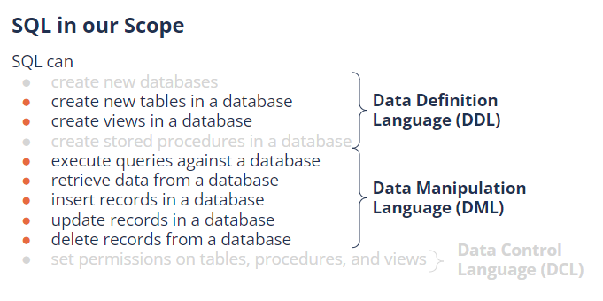

## Lecture: Intro SQL

### Review:

> **Relational database**: 
>
> ​	A relational database is **table-oriented** where **every bit of data has a link with every other bit of data**. It has 	a row-based table structure which connects related data elements. **predefined relationships**
>
> **Who can access a database?**
>
> - Database Administrator (DBA)
> - End-User
> - System Analyst
> - Application Programmer
> - Database Designer

### What is SQL ?

- SQL stands for **Structured Query Language**

- It allows you access and manipulate relational databases

- It became a standard of the American National Standards Institute (ANSI) in 1986, and of the International Organization for Standardization (ISO) in 1987

- There are different **versions/flavors/dialects** of the SQL language, depending on the database program used (ex. MySQL, MS Access, Microsoft SQL Server, Orcale)

- All versions are very similar in their construction and their support for the main commands 

  

SQL is one of the most important technical skills/tools for a data professional. 

Some of **THE THINGS IT CAN DO**:

1. SQL can create and delete databases

2. SQL can create and delete tables in a database

3. SQL can insert, delete and update records in a database

4. SQL can retrieve data from a database

5. SQL can also clean retrieved data before further manipulation (with python for example) to carry out an analysis

   

SOURCE: [Google Slides NF](https://docs.google.com/presentation/d/194YQjsnfRf5C8eAXJR_IFNQpNJvxG20HHE7YUEaC2-U/edit#slide=id.ge2e1e88cd7_0_2869)

## Database Structure

- A database consists of one/multiple schemas
- Schemas consist of tables
- Tables consist of columns and rows
- A column is a variable and has a unique name 
- A row is an observation
- Every cell is a single value