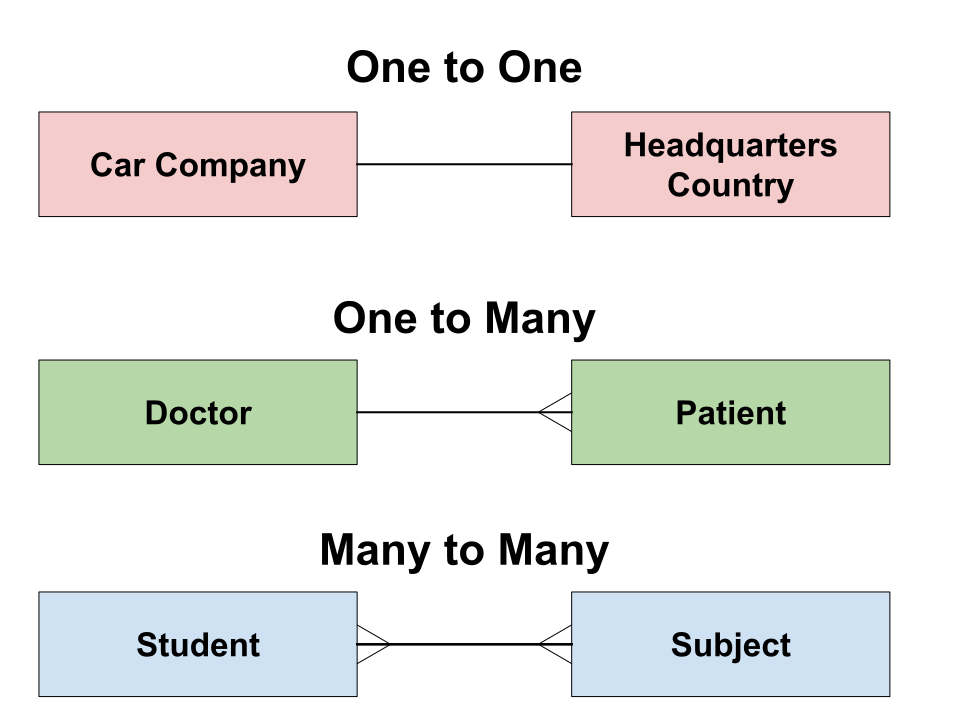

# Lecture: Foreign keys

### Objectives:


1. Database constraints
2. What are Primary Keys (PK) in a database ? 
3. What are Foreign Keys (FK) in a database ?
4. Adding Foreign Keys
5. Relationships/Cardinalities of Tables


## 1. Database Constraints

Because relational databases allow us to provide 24/7 access to a big amount of data, it only makes sense to make the database structure organized, integral and robust. For example, we want to avoid having same user signing up twice, or to ensure there are no negative distances, or we don't want to discontinue product checkout while there are still offers available.

To enforce and maintain consistency and accuracy of the data within a database, SQL provides a **set of rules** applied to table columns, called **CONSTRAINTS**. These rules define the valid conditions for data within the table. 

We are going to look at some of them:

- **NOT NULL**: Prevent null values in a specified column.
- **UNIQUE**: Ensure all values in a column or a group of columns are unique across all rows in the table
- **PRIMARY KEY**: A combination of a unique constraint and a not-null constraint. It uniquely identifies each row in a table.
- **FOREIGN KEY**: Enforce referential integrity between two tables.

>  SIDE-BAR:  Check [PostgreSQL: Documentation](https://www.postgresql.org/docs/current/ddl-constraints.html)  also for constraints CHECK and EXCLUDE (not covered here)

Constraints can be added during the table creation 

```sql
CREATE TABLE students (
  student_id SERIAL PRIMARY KEY,
  student_name VARCHAR(255) NOT NULL,
  email TEXT UNIQUE
);
```

or afterwards

```sql
CREATE TABLE students (
  student_id SERIAL,
  student_name VARCHAR(255),
  email TEXT
);

ALTER TABLE students ADD PRIMARY KEY (student_id);
ALTER TABLE students ALTER COLUMN student_name SET NOT NULL;
ALTER TABLE students ADD UNIQUE (email);
```


While **NOT NULL** and **UNIQUE** constraints are straightforward rules, **PRIMARY KEY** and **FOREIGN KEY** constraints require a closer look.


## 2. PRIMARY KEY 

A `primary key` is a column (or combination of columns) which uniquely identifies each row in a table. It is a reference for each row. 

#### PK Conditions:
1. The values of `primary key` must be unique 

2. A `primary key` can not contain null values

3. A table can have only **ONE** primary key

#### The main benefits of a PRIMARY KEY:

- allows quick data retrieval based on just three things:   
    * table name  
    * column name   
    * the row value of the `primary key`  
- helps updating and deleting of specific records
- prevents record duplicates in a table
- makes sure there are no null values
- helps setting up relationships between tables which indicates the logical structure of the data base

https://www.scaler.com/topics/sql/primary-key-in-sql/


## 3. FOREIGN KEY 

A `foreign key` is a column (or combination of columns) in one table, that refers to the `primary key` in another table. Basically it links two tables together. 
#### FK Conditions:
1. `foreign key` columns must have same type as the referenced column

2. The `foreign key` column accepts null values

3. Duplicate values can be stored in the foreign key column

4. There can be more than one foreign key in a table

5. Defining foreign keys within a table is optional

> Note: The table with the `foreign key` is called the child table, and the table with the `primary key` is called the referenced or parent table.

#### The main benefits of a FOREIGN KEY:

`foreign key` constraints enforce referential integrity.
- the `foreign key constraint` is used to prevent actions that would destroy links between tables
- if column value A refers to column value B, then column value B must exist (existence)
- if the `primary key` does not contain a particular value, that value cannot be present in the `foreign key` (correctness)
- a `primary key` can only be modified if the `foreign key` can be adjusted accordingly (safety mechanism)
- easy investigation of dependencies between tables

https://www.scaler.com/topics/sql/foreign-key-in-sql/
#### Examples in other words:

- They bar you from changing the FK value to one which doesn’t exist as a value in the related table’s PK

- They stop you from deleting a row from the PK table. This stops you from creating orphan records

- They stop you from adding a FK value that doesn’t exist in the PK

  
## Adding a Foreign Key

The syntax for adding a PK using ALTER TABLE:
```sql
ALTER TABLE child_table_name
ADD FOREIGN KEY (child_foreign_key_column_name) REFERENCES parent_table(parent_primary_key_column);
```

**Example:**

```sql
CREATE TABLE enrolments (
  enrolment_id SERIAL PRIMARY KEY,
  seminar_name VARCHAR(255),
  student_id INT
);

ALTER TABLE enrolments
ADD FOREIGN KEY (student_id) REFERENCES students(student_id);
```
> Alternatively we can set up the foreign key inside the code of table creation (see today's challenge):
>
> ```sql
>DROP TABLE IF EXISTS enrolments;
>CREATE TABLE enrolments (
>enrolment_id SERIAL PRIMARY KEY,
>seminar_name VARCHAR(255), 
>student_id INT REFERENCES students(student_id) -- Option 1
>  --  ,FOREIGN KEY (student_id) REFERENCES students(student_id) -- Option 2
>  );
>  
>--ALTER TABLE enrolments
>--ADD FOREIGN KEY (student_id) REFERENCES students(student_id); -- Option 3
>```
>Once this relationship has been established the parent table cannot be dropped unless the child is dropped beforehand. Any table that has dependents cannot be dropped.


**Adding data to the tables for Experiments:**
```sql
INSERT INTO students (student_name, email)
VALUES 
('Anna', 'anna@gmail.com')
,('Joseph', 'joseph@gmail.com')
,('Scally', 'scally@gmail.com')
,('Liam', 'liam@gmail.com')
,('Elif', 'elif@gmail.com');

INSERT INTO enrolments (seminar_name, student_id)
VALUES 
('science', 2)
,('history', 1)
,('ethics', 2)
,('politics', 1)
,('art', 5)
,('engineering', 4);
```
### Testing Structural Integrity

**Test 1: Dropping Parent Table**
```sql
DROP TABLE students;
```
**Test 2: Updating a value in the Primary Key**
```sql
UPDATE students
SET student_id = 6
WHERE student_name = 'Anna';
```
**Test 3: Adding row with a Foreign Key value unknown to the Primary Key**
```sql
INSERT INTO enrolments (seminar_name, student_id)
VALUES ('sport', 8)
```


## Cascade

One of the main reasons that tables are connected using primary and foreign keys is to ensure the integerity of the data. These relationships prevent the deletion or alteration of data one table that has a parent-child relationship with another.

The parent-child relationship prevents the parent table from being dropped using a normal DROP TABLE command. The work around is adding the CASCADE argument. This will in turn not only drop the parent table but will cascade to all the children tables and drop the foreign key contraints.

Syntax:  
```sql
DROP TABLE IF EXISTS table_name CASCADE;
```
<br>
<br>
<br>

## Cardinalities

https://www.indeed.com/career-advice/career-development/cardinality-database

<center></center>


You can use Foreign Keys to create three basic types of relationships. These are also called cardinalities of tables. 

#### One to One (least common)

In this type of entity the occurrence of one entity will be directly in relationship with only one occurrence of another entity. There should not be more than one occurrences for each entity.

*Examples:*
- A car company only has one headquarters country. So there is always one to one relationship between Car Company –> Headquarters Country.*

- A school may use cardinality in its student database to show a one-to-one relationship between each student and their student ID number.

#### One to Many (most common)

In one to many the occurrence of a single entity is always related to more than one occurrences (many) of another entity.

*Examples:*
- One doctor has many patients. That relationship is always one to many relationship. 
- In our music data we have a one to many relationship with artist --> songs.*
- An online food delivery service may create a data table to store all its customer ID numbers. It may also create another table for unique order ID numbers.

#### Many to Many (often rather split to one-to-many)

In this type many occurrences of one entity are related to more than one occurrences of another entity.

*Examples:*

- Many students study many different subjects. 
- If some of our artist covered each others songs then there would also be a many to many relationship*
- A book online database. It might include a list of book titles in one table and a list of author names in another table. Many of the authors may have multiple books and some of the authors may have even co-written books together.